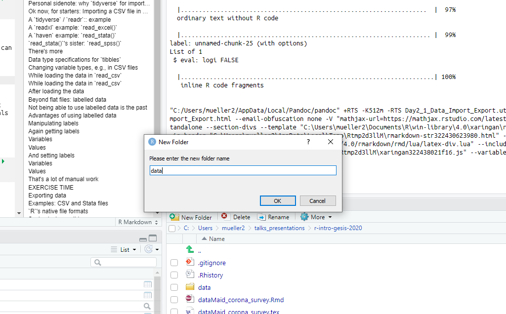

layout: true

```{r setup, include = FALSE}
source("../xaringan_r_setup.R") 
xaringanExtra::use_xaringan_extra(c("tile_view", "clipboard"))
xaringanExtra::use_extra_styles(
  hover_code_line = TRUE,         #<<
  mute_unhighlighted_code = TRUE  #<<
)
```

<div class="my-footer">
  <div style="float: left;"><span>`r gsub("<br />", ", ", gsub("<br /><br />|<a.+$", "", metadata$author))`</span></div>
  <div style="float: right;"><span>`r metadata$location`, `r metadata$date`</span></div>
  <div style="text-align: center;"><span>`r gsub(".+<br />", " ", metadata$subtitle)`</span></div>
</div>

```{css, echo = FALSE}
.tinyish .remark-code { /*Change made here*/
  font-size: 70% !important;
}

.tinyisher .remark-code { /*Change made here*/
  font-size: 50% !important;
}
```

---

## Getting data into `R`
Thus far, we've already learned what `R` and `RStudio` are. We also know how we can start our own programming project in R. Still, this course is about starting to use R and feeling prepared to use it for statistical analyses. There's one essential prerequisite:

.center[**We need data!**]

```{r, out.width = "50%", echo = FALSE}
include_graphics("./pics/import_data.png")
```

---

## Data we use in this course
During the course, we use several different datasets. Mainly in this session, where we apply different importing functions, we use a large variety ranging from the classic titanic datasets to the one about unicorns.

---

## GESIS Panel Data on the Coronavirus Outbreak
.left-column[
```{r echo = FALSE}
knitr::include_graphics("./pics/gesis_panel_logo_web.jpg")
```
]

.right-column[
For most of the examples and exercises in this course, however, we will use the [Public Use File (PUF) of the GESIS Panel Special Survey on the Coronavirus SARS-CoV-2 Outbreak in Germany](https://www.gesis.org/gesis-panel/coronavirus-outbreak/public-use-file-puf). You can [download the dataset in different formats as well as the codebook and the questionnaire (in German) from the *GESIS* Data Archive](https://search.gesis.org/research_data/ZA5667) (note: you need to have/create a user account).

The *GESIS Panel* website provides [detailed documentation](https://www.gesis.org/gesis-panel/documentation), including a [cheatsheet](https://www.gesis.org/fileadmin/upload/forschung/programme_projekte/Drittmittelprojekte/GESIS_Panel/gesis_panel_cheatsheet.pdf).
]

---

## Gapminder Data
.left-column[
```{r echo = FALSE}
knitr::include_graphics("./pics/gapminder_logo.png")
```
]

.right-column[
Another often uses dataset is the [Gapminder Data](https://www.gapminder.org/data/). During the course and the exercises, we work with data we have downloaded from their website. You can also install some of the data directly in `R` for using it with the command `install.packages("gapminder")`.

The R package provides ["[a]n excerpt of the data available at Gapminder.org. For each of 142 countries, the package provides values for life expectancy, GDP per capita, and population, every five years, from 1952 to 2007."](https://cran.r-project.org/web/packages/gapminder/index.html)
]

---

## How to use the data in general
To code along and be able to do the exercises, you should store the files (at least from the GESIS Panel) in a folder called `data` in the same folder as the other materials for this course.

```{r, echo = FALSE, out.width = "50%"}

```

---

## What's great about R is that it's data-agnostic
```{r, echo = FALSE}
knitr::include_graphics("./pics/Datenimport.PNG")
```

---

## What's intimidating: the choice of packages
.pull-left[
**What you will learn**
- Getting the most common data formats into R
  - e.g., CSV, Stata, SPSS, or Excel spreadsheets
- Using the most recent methods of doing that
- We will rely a lot on the procedures of the `tidyverse` instead of standard R
]

.pull-right[
**What you won't learn**
- Getting old & obscure binary data formats in R
  - [it's possible](https://cran.r-project.org/doc/manuals/r-release/R-data.html)
]

---

## Before writing any code: Rstudio functionality to import data
R is no longer just for command line heroes. In the powerful GUI menu, you can also select and load your data using the mouse. It's under "Environment - Import Dataset - choose file type".

```{r, echo = FALSE}
knitr::include_graphics("./pics/rstudio_import.PNG")
```

---

## Where to find data

### Browse Button in RStudio
```{r, echo = FALSE}
knitr::include_graphics("./pics/importBrowse.PNG")
```

### Code preview in Rstudio
```{r, echo = FALSE}
knitr::include_graphics("./pics/codepreview.PNG")
```

---

## Honestly, after some time you will write the code directly
.center[

]

.footnote[https://media.giphy.com/media/LmNwrBhejkK9EFP504/source.gif]

---

## Simple vs. not so simple file formats

Basic file formats, such as CSV (comma-separated value file), can directly be imported into R
- they are 'flat'
- few metadata
- basically text files

Other file formats, particularly the proprietary ones, require the use of additional packages
- they are complex
- a lot of metadata (think of all the labels in an SPSS file)
- they are binary (1110101)


---

## File formats are subject of war

```{r echo = FALSE, out.width = "30%"}
knitr::include_graphics("./pics/norm_normal_file_format.png")
```
https://xkcd.com/2116/

---

## Personal sidenote: why `tidyverse` for importing?
For simple files, base-`R` provides proper tools for importing.

Yet, for importing other files, we have to rely on additional packages anyway.
- `tidyverse` and its friends help to get an order in all the different tools
- the tidy data format also facilitates adding metadata to imported data
  - they are tibbles
  - a specific kind are labelled data (see below)
- provides some sane defaults, e.g., by automatic data type detection

---
class: middle

**In the following slides, we'll jump right into importing data. We use a lot of different packages for this purpose, and you don't have to remember everything. It's just for making a point of how agnostic `R` actually is regarding the file type. Later on, we will dive into the specifics of importing.**

---

## Ok now, for starters: Importing a CSV file in standard `R` using `utils`

```{r loadtitanic, eval = FALSE}
titanic <- read.csv("../../data/titanic.csv")

titanic
```

.right[`r emo::ji("left_arrow_curving_right")`]

---
class: middle
.tinyish[
```{r ref.label = "loadtitanic", echo = FALSE}
```
]

---

## A `tidyverse` / `readr` example
```{r readr_example, echo = TRUE}
library(readr)

titanic <- read_csv("../../data/titanic.csv")
```

Please note the column specifications. `readr` 'guesses' them based on the first 1000 observations (we will come back to this later).

---
class: middle
.tinyish[
```{r readr_example_output, echo = TRUE}
titanic
```
]

It's that easy!

---

## A `readxl` example: `read_excel()`
```{r readxl_example, echo = TRUE}
library(readxl)

unicorns <- read_xlsx("../../data/observations.xlsx")
```

No output `r ji("frowning_face")`

---
class: middle
```{r readxl_example_output, echo = TRUE}
unicorns
```

---

## A `haven` example: `read_stata()` 
```{r read_stata_example, echo = TRUE}
library(haven)

gp_covid <- 
  read_stata("../../data/ZA5667_v1-1-0_Stata14.dta")
```

Note: The [`gesis` package](https://github.com/expersso/gesis) allows direct access to the *GESIS* Data Catalogue (DBK) in `R`, given that you have a DBK account.

---

```{r read_stata_example_output, echo = TRUE}
gp_covid
```

---

## `read_stata()`'s sister: `read_spss()`
Indeed, there's also the function `read_spss()` to import SPSS files.

It also provides capabilities to handle SPSS-defined missing values by setting the option `user_na = TRUE` (default is `FALSE`).

The [`sjlabelled` package](https://cran.r-project.org/web/packages/sjlabelled/index.html) can also be used to choose a more elaborated approach for missing values: https://cran.r-project.org/web/packages/sjlabelled/vignettes/intro_sjlabelled.html

**We will come back to Stata and SPSS files since they depict a specific file format in `R`: labelled data.**

---

## There's more
These were just some very first examples of applying functions from each package. They comprise even more functions for different data types.

- readr
  - `read_csv()`
  - `read_tsv()`
  - `read_delim()`
  - `read_fwf()`
  - `read_table()`
  - `read_log()`
- haven
  - `read_sas()`
  - `read_spss()`
  - `read_stata()`

Not to mention all the helper functions and options. For example, we can define the cells to read from an Excel file by specifying the option `range = "C1:E4"` in `read_excel()`

---

## Data type specifications for `tibbles`
- characters
  - indicated by `<chr>`
  - specified by `col_character()`
- integers
  - indicated by `<int>`
  - specified by `col_integer()`
- doubles
  - indicated by `<dbl>`
  - specified by `col_double()`
- factors
  - indicated by `<fct>`
  - specified by `col_factor()`
- logical
  - indicated by `<lgl>`
  - specified by `col_logical()`
  
.center[**There's more, but we'll leave it at that for now.**]

---

## Changing variable types, e.g., in CSV files
As mentioned before, `read_csv` 'guesses' the variable types by scanning the first 1000 observations. NB: **This can go wrong!**

Luckily, we can change the variable type...
- before/while loading the data
- and after loading the data

---

## While loading the data in `read_csv`
.tinyish[
```{r readr_example_col_change, eval = FALSE}
titanic <-
  read_csv(
    "../../data/titanic.csv",
    col_types = cols(
      PassengerId = col_double(),
      Survived = col_double(),
      Pclass = col_double(),
      Name = col_character(),
      Sex = col_character(),
      Age = col_double(),
      SibSp = col_double(),
      Parch = col_double(),
      Ticket = col_character(),
      Fare = col_double(),
      Cabin = col_character(),
      Embarked = col_character()
    )
  )

titanic
```
]

.right[`r emo::ji("left_arrow_curving_right")`]

---
.tinyish[
```{r ref.label = "readr_example_col_change", echo = FALSE}
```
]

---

## While loading the data in `read_csv`
.tinyish[
```{r readr_example_col_changeD, eval = FALSE}
titanic <-
  read_csv(
    "../../data/titanic.csv",
    col_types = cols(
      PassengerId = col_double(),
      Survived = col_double(),
      Pclass = col_double(),
      Name = col_character(),
      Sex = col_factor(), # This one changed!
      Age = col_double(),
      SibSp = col_double(),
      Parch = col_double(),
      Ticket = col_character(),
      Fare = col_double(),
      Cabin = col_character(),
      Embarked = col_character()
    )
  )

titanic
```
]

.right[`r emo::ji("left_arrow_curving_right")`]

---
.tinyish[
```{r ref.label = "readr_example_col_changeD", echo = FALSE}
```
]

---

## After loading the data

```{r readr_example_col_changeD_after, echo = TRUE}
titanic <-
  readr::type_convert(
    titanic,
    col_types = cols(
      PassengerId = col_double(),
      Survived = col_double(),
      Pclass = col_double(),
      Name = col_character(),
      Sex = col_factor(),
      Age = col_double(),
      SibSp = col_double(),
      Parch = col_double(),
      Ticket = col_character(),
      Fare = col_double(),
      Cabin = col_character(),
      Embarked = col_character()
    )
  )
```

---

## Beyond flat files: labelled data
A lot of data you get and find or even collect comes in some flat file, such as CSV. In the social sciences, however, we often deal with proprietary file formats, such as SPSS's .sav or Stata's .dta files. 

What we often find in these data are labels. These labels are used to describe variables or variable values. They comprise some specific metadata inherent in these proprietary file formats. 

*If you were able to travel ten years back in time and ask an `R` geek, she'd say that you cannot use labels in R. You'd either have to import, e.g., value labels as character strings or use their codes as factors.*

---

## Not being able to use labelled data is the past
Nowadays, if you use the `haven` package, labels are built-in. For example:

```{r}
gp_covid["age_cat"]
```

---

## Advantages of using labelled data
One could rejoice not having to use a codebook any more, just like in SPSS. And I think by and large this is true, although just looking at code output for glimpsing at data is somewhat... geeky. 

An advantage definitely is that you could re-use the labels in figures and plots, some packages do that automatically, such as the `sjPlot` package.

Yet, primarily when you exchange your data with colleagues who do not use `R` or when you plan to publish your data (what you should always consider), being able to export data you have manipulated in `R` is great.
- yes, you can do that with labelled data.

**However, be aware of the missing values hell originating in SPSS's and Stata's different missing values definitions**

---

## Manipulating labels
I used to be a data ingest and preparation guy at the GESIS Data Archive. For this job, I had to use SPSS or Stata for my work, albeit 'privately' I worked with `R` all the time for my dissertation. I would have let Elon Musk name my firstborn child if I could have been able to perform all these tasks in `R`.

Luckily, the generation after me at least could start to use `R` now for labeling or relabelling data with additional packages. One of those is the `sjlabelled` package from Daniel Lüdecke.

.footnote[The name of his child is X Æ A-12]

---

## Again getting labels

### Variables 
```{r}
sjlabelled::get_label(gp_covid$age_cat)
```

### Values
.tinyish[
```{r}
sjlabelled::get_labels(gp_covid$age_cat)
```
]

---

## And setting labels: Variables

```{r}
gp_covid$age_cat <- 
  sjlabelled::set_label(gp_covid$age_cat, label = "Age, categorized")

sjlabelled::get_label(gp_covid$age_cat)
```

---

## And setting labels: Values
.tinyish[
```{r}
gp_covid$age_cat <- 
  sjlabelled::set_labels(
    gp_covid$age_cat,
    labels = 
      c(
        "<=25 Years", "26 bis 30 Years", "31 bis 35 Years", "36 bis 40 Years",
        "41 bis 45 Years", "46 bis 50 Years", "51 bis 60 Years", 
        "61 bis 65 Years", "66 bis 70 Years", ">=71 Years"
      )
  )

sjlabelled::get_labels(gp_covid$age_cat)
```
]

---

## That's a lot of manual work
Yeah, this requires some tedious manual work that has to be done, at least by somebody. But that's just how it is, even in SPSS or Stata. Indeed, we may want to wait until using it in `R` scales a bit more. Integrating basic labelling of variables in a pipe workflow, however, is already straightforward:

```{r}
gp_data_subset <-
  gp_covid %>% 
  dplyr::select(age_cat, sex) %>% 
  sjlabelled::var_labels(
    age_cat = "Age in Categories",
    sex = "Gender in Binary Form"
  )

sjlabelled::get_label(gp_data_subset)
```

Ok, but that's already data wrangling, a topic for this afternoon.

---

class: center, middle

# [Exercise](XXX) time `r ji("weight_lifting_woman")``r ji("muscle")``r ji("running_man")``r ji("biking_man")`

## [Solutions](XXX)

---

## Exporting data
Sometimes our data have to leave `R`, for example, if we....
- share data with colleagues who do not use `R`
- want to continue where we left off
  - particularly, if data wrangling took a long time
  
For such purposes we also need a way to export our data.

All of the packages we have discussed in this session also have designated functions for that.

```{r, out.width = "50%", echo = FALSE}
include_graphics("./pics/export_data.png")
```

---

## Examples: CSV and Stata files
```{r export_csv, echo = TRUE}
write_csv(titanic, "titanic_own.csv")
```

```{r export_stata, echo = TRUE}
write_dta(titanic, "titanic_own.dta")
```

Proof that they have been exported:
```{r list_files, echo = TRUE}
list.files() 
```

---

## `R`'s native file formats
If you plan to continue to work with R (something we would always recommend `r emo::ji("stuck_out_tongue_winking_eye")`), there are at least two native 'file formats' to choose from. The advantage of using them is that they are compressed files so that they don't occupy unnecessary large disk space. Moreover, they are already prepared as you left them, and they take less time to be loaded (not a big deal in a small data world).

`.Rdata` files saving and loading:

```{r, eval = FALSE}
save(mydata, file = "mydata.RData")
load("mydata.RData")
```

`.rds` files saving and loading.

```{r, eval = FALSE}
saveRDS(mydata, "mydata.rds")
mydata <- readRDS("mydata.rds")
```


`saveRDS()` just save a representation of the object, which means you can name whatever you want when loading. That's great!

---

## Saving just everything
You may already have noticed that: When closing Rstudio, by default, the programs asks you whether you want to save the workspace image. 

```{r, out.width = "50%", echo = FALSE}
include_graphics("./pics/save_image.png")
```

You can do that by your own using the `save.image()` function:

```{r, eval = FALSE}
save.image(file = "my_fancy_workspace.RData")
```

---

## Additional packages
The great benefit of `tidyverse` import functions is the import of the data as tibbles: the data are potentially tidier.

Several other non-tidyverse packages provide similar benefits as they make use of this universal data format:
- [`sf`](https://github.com/r-spatial/sf) for geospatial data

- [`sjlabelled`](https://cran.r-project.org/web/packages/sjlabelled/index.html) to work with labelled data, e.g., from SPSS or Stata

---

## Other packages for data import

- `base` R
- the [`foreign` package](https://cran.r-project.org/web/packages/foreign/index.html) for SPSS and Stata files
- [`data.table`](https://cran.r-project.org/web/packages/data.table/index.html) or [`fst`](https://www.fstpackage.org/) for large datasets
- [`jsonlite`](https://cran.r-project.org/web/packages/jsonlite/index.html) for json files
- [`datapasta`](https://github.com/MilesMcBain/datapasta) for copying and pasting data into tribbles (e.g., from websites, Excel or Word files)


---

## Final note on file paths
There is this simple rule of never using absolute file paths to maintain your code reproducibly and future-proof. We already had this in the introduction, it's just to remind you as this is particularly important for data importing and exporting.

```{r eval = FALSE}
# Windows
load("C:/Users/cool_user/data/fancy_data.Rdata")

# Mac
load("/Users/cool_user/data/fancy_data.Rdata")

# GNU/Linux
load("/home/cool_user/data/fancy_data.Rdata")
```

---

## Use relative paths
Instead of using absolute paths, it is recommended to use relative file paths. The idea is from starting where your current script currently exists and navigate to your target location. Say we are in the "C:/Users/cool_user/" location on a Windows machine. To load your data, we would use:

```{r eval = FALSE}
load("./data/fancy_data.Rdata")
```

If we were in a different folder, e.g., "C:/Users/cool_user/cat_pics/mauzi/", we would use:

```{r eval = FALSE}
load("../../data/fancy_data.Rdata")
```

---

class: center, middle

# [Exercise](XXX) time `r ji("weight_lifting_woman")``r ji("muscle")``r ji("running_man")``r ji("biking_man")`

## [Solutions](XXX)